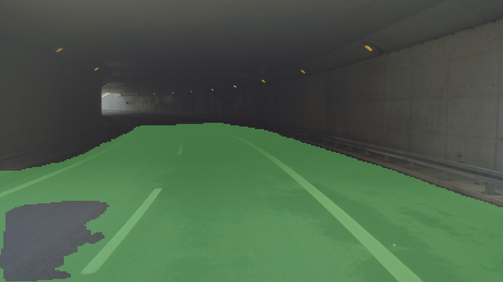
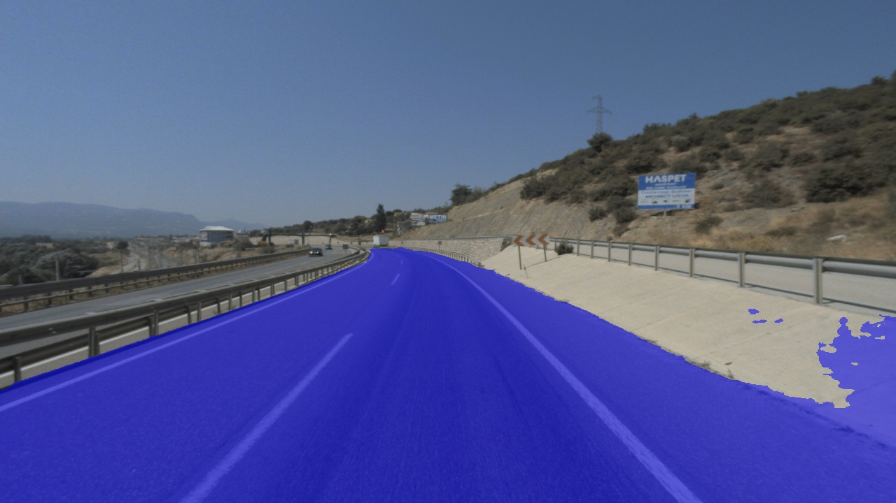
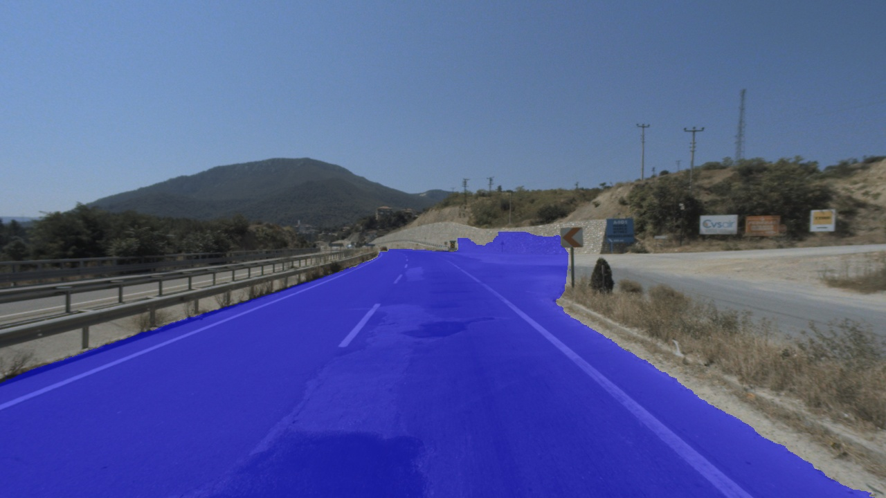
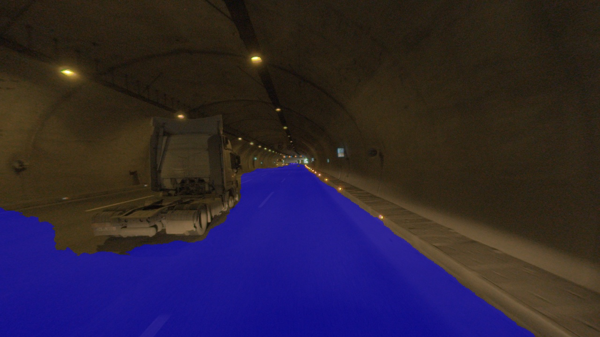

# README

The goal in this project is to automatically segment the road from front camera view.

# Introduction<a name="intro"></a>

The goal of this project is to segment a drivable areas from a set of road images. These segmentations are used for autonomous vehicles. It provided the dataset that required much more focus on dealing with inconsistencies and differences in the limited data collection. As a result, most of our efforts went to trying out different ways to preprocess and combine different kinds of data.

### The Data

The data set consists of 8555 images. The data set consists of 8555 images, 4278 of which are cfc60 data and 4277 are cfc120 data.	


<table>
    <tr>
        <th>CFC</th>
        <th>CFCU</th>
    </tr>
    <tr>
        <th></th>
        <th></th>
    </tr>
</table>
 

### Workflow


# Preprocessing<a name="prep"></a>

### Json to Mask

Supervisely Annotation Format supports to polygon figures.

```json
{
    "id": 503004154,
    "classId": 1693021,
    "labelerLogin": "alexxx",
    "createdAt": "2020-08-21T15:15:28.092Z",
    "updatedAt": "2020-08-21T16:06:11.461Z",
    "description": "",
    "geometryType": "polygon",
    "tags": [],
    "classTitle": "Freespace",
    "points": {
        "exterior": [
            [
                730,
                2104
            ],
            [
                2479,
                402
            ],
            [
                3746,
                1646
            ]
        ],
        "interior": [
        [
            [
                1907,
                1255
            ],
            [
                2468,
                875
            ],
            [
                2679,
                1577
            ]
        ]
        ]
    }
}
```

- **geometryType**: "polygon" - class shape
- **exterior** - list of points [point1, point2, point3, etc ...] where each point is a list of two numbers (coordinates) [col, row]
- **interior** - list of elements with the same structure as the "exterior" field. In other words, this is the list of polygons that define object holes. For polygons without holes in them, this field is empty

The cv2 library's fillPoly function is used to draw a mask. Then, if the mask contains interior points, we exclude those points.

```python
mask = cv2.fillPoly(mask,np.array([obj['points']['exterior']]),color=1)
if len(obj['points']['interior']) != 0:
	mask = cv2.fillPoly(mask,inter,color=0)
```

<table>
    <tr>
        <th>With Hole</th>
        <th>Without Hole</th>
    </tr>
    <tr>
        <th></th>
        <th></th>
    </tr>
</table>

## One Hot Encode
This is where the integer encoded variable is removed and one new binary variable is added for each unique integer value in the variable. In the project we have two categories: freespace and background. Insert the value [0,1] for the background and [1,0] for the freespace.

### Sample

```python
encoded_labels = [[0,1],[1,0]]
        
        for i in range(n_classes):
            bl_mat = mask[:,:] == i
            encoded_data[bl_mat] = encoded_labels[i]
        
        return encoded_data
```

```matlab
[[1 0 0]                     [[[1 0][0 1][0 1]]
 [0 1 0]       ----->         [[0 1][1 0][0 1]]
 [1 0 0]]                     [[1 0][0 1][0 1]]]

```

## Augmentation

To avoid overfitting, I deployed data augmentation. 

<table>
    <tr>
        <th></th>
        <th>Image</th>
	<th></th>
        <th>Image</th>
    </tr>
    <tr>
        <td>Original Image</td>
        <td></td>
        <td>RandomBrightness</td>
        <td></td>
    </tr>
    <tr>
        <td>RandomContrast</td>
	<td></td>
        <td>Gaussian Blur</td>
        <td></td>
    </tr>
    <tr>
        <td>Crop</td>
        <td></td>
        <td>Horizontal Flip</td>
        <td></td>
    </tr>
</table>

---

<table>
    <tr>
        <th>Before Augmentation</th>
        <th>After Augmentation</th>
    </tr>
    <tr>
        <td></td>
	<td></td>
    </tr>
    <tr>
        <td></td>
	<td></td>
    </tr>
    <tr>
        <td></td>
	<td></td>
    </tr>
</table>

# Cross Validation

Cross-validation is a resampling procedure used to evaluate machine learning models on a limited data sample.

- The dataset is divided into k groups.
- The selected group is used as the validation set.
- All other groups (k-1 groups) are used as train sets.


# Training

### Network architecture

Typical U-Net architecture was used in the project, which took in 2D image arrays with two channels (background,freespace).Then the inputs went through a series of convolutional and pooling layers and were turned into feature maps with smaller size. The resulting feature maps then pass a series of up-convolutional and concatenating layers and finally, the network output a segmentation mask.

  

### Model Comparison

  

### Optimizer

The Adam optimizer was used to train the parameters.


### Error Function

I've tried a few error functions, but the BCEDice coefficient works best.

## Predict Examples

  

  

  

---

  

  

## Limitations

### The distance between two cones is too far

  
